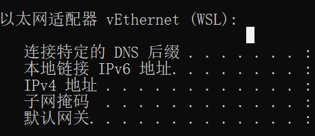
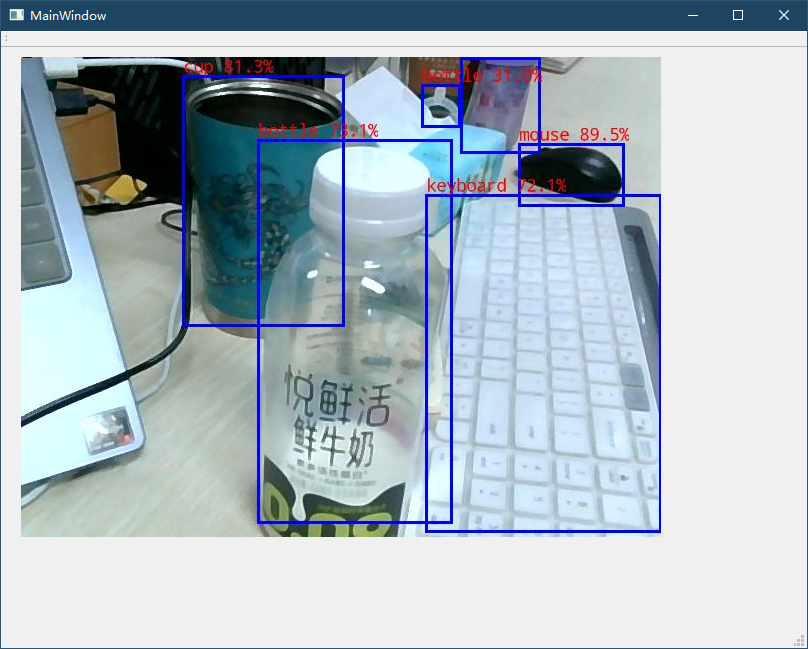
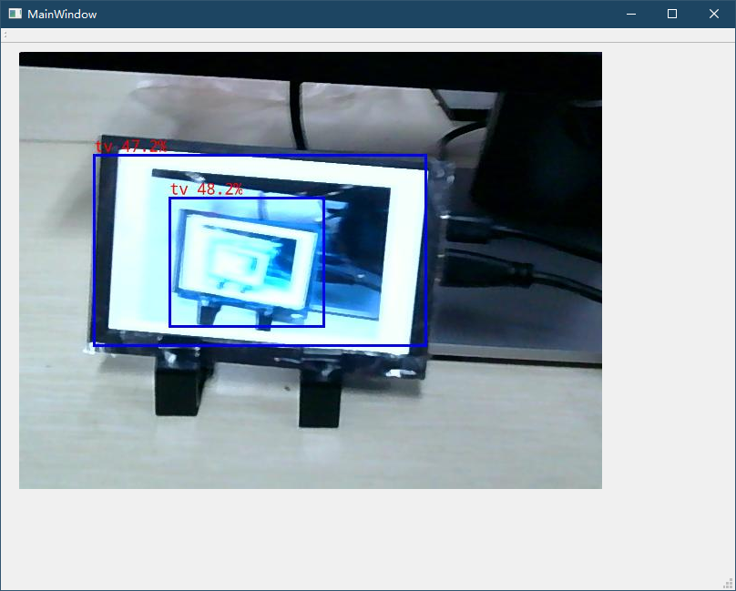
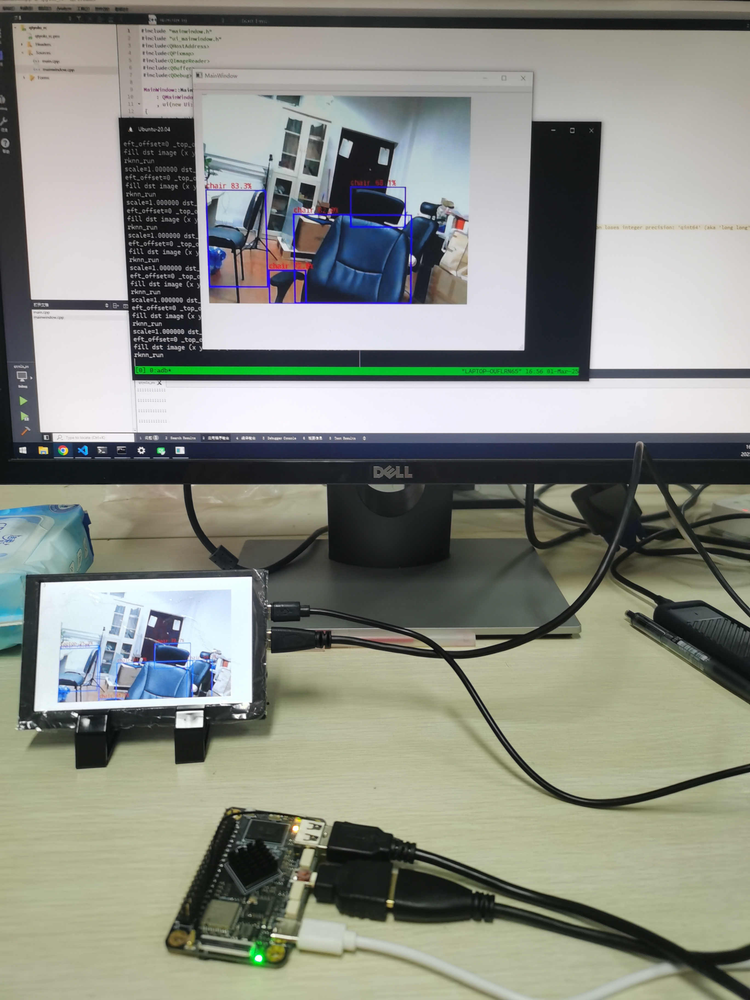

# Qt_YOLOv5_RK3566

- [Qt\_YOLOv5\_RK3566](#qt_yolov5_rk3566)
  - [Overview 简介](#overview-简介)
  - [Tree 文件描述](#tree-文件描述)
  - [Device Connection 设备连接](#device-connection-设备连接)
    - [1. Install adbkit 安装adbkit](#1-install-adbkit-安装adbkit)
    - [2. USB to TCP](#2-usb-to-tcp)
  - [Dependency 依赖库安装](#dependency-依赖库安装)
    - [1. RKNN-Toolkit2](#1-rknn-toolkit2)
    - [2. Qt5](#2-qt5)
    - [3. OpenCV](#3-opencv)
  - [Getting Started 如何使用](#getting-started-如何使用)
    - [Evn 设置环境](#evn-设置环境)
    - [Compile client 编译客户端](#compile-client-编译客户端)
    - [Run client 运行客户端](#run-client-运行客户端)
    - [Run server 运行服务端](#run-server-运行服务端)
  - [Screenshots 效果展示](#screenshots-效果展示)

## Overview 简介

A Qt project application based on YOLOv5 in the [rknn_model_zoo](https://github.com/airockchip/rknn_model_zoo) example, using Opencv to read the camera and display it on the Qt interface, while streaming to the client via UDP

基于[rknn_model_zoo](https://github.com/airockchip/rknn_model_zoo)示例中YOLOv5的一个Qt项目应用，采用Opencv读取摄像头，并显示到Qt界面上，同时通过UDP推流到客户端

The detection model has not been improved yet, and the original model in the open source project is still used

检测模型尚未进行改良，使用的还是开源项目中的原模型

* Platform: RK3566（泰山派开发板2G+16G版本）
* Qt version: 5.12.10
* Opencv version: 3.4.1
* environment: WSL2

## Tree 文件描述
```
.
├── 3rdparty                    # 第三方库
├── CMakeLists.txt
├── README.md
├── Windows                     # 客户端Demo
│   ├── main.cpp
│   ├── mainwindow.cpp
│   ├── mainwindow.h
│   ├── mainwindow.ui
│   ├── qtyolo_rc.pro
│   └── qtyolo_rc.pro.user
├── YOLOv5                      # 检测模型
│   ├── cpp
│   └── model
├── build-linux.sh              # 编译装载脚本
├── main.cpp                    # 主函数
├── mainwindow.cpp
├── mainwindow.h
├── mainwindow.ui
└── utils                       # 工具
    ├── CMakeLists.txt
    ├── audio_utils.c
    ├── audio_utils.h
    ├── common.h
    ├── file_utils.c
    ├── file_utils.h
    ├── font.h
    ├── image_drawing.c
    ├── image_drawing.h
    ├── image_utils.c
    └── image_utils.h
```
## Device Connection 设备连接
Since WSL2 cannot recognize USB devices, I have been copying files in WSL2 to Windows and then using adb to transfer them to Taishan Pi, that is, WSL2<--->Windows<--->board. Later, I found that adbkit can simulate USB devices into TCP ports, and then connect to WSL2 through the network, so that it can be done in one step: board<--->WSL2

由于WSL2无法识别USB设备，之前一直是将WSL2中的文件copy到Windows再利用adb传到泰山派上，即WSL2<--->Windows<--->板子，后来发现adbkit可以将USB设备模拟成tcp端口，然后再通过网络连接到WSL2，这样就可以一步到位：板子<--->WSL2
### 1. Install adbkit 安装adbkit
First install [node](https://nodejs.org/zh-cn/download) on Windows

首先在Windows上安装[node](https://nodejs.org/zh-cn/download)

```shell
# Download and install fnm:
winget install Schniz.fnm
# Download and install Node.js:
fnm install 22
# Verify the Node.js version:
node -v # Should print "v22.14.0".
# Verify npm version:
npm -v # Should print "10.9.2".
```
After the installation is complete, remember to add node to the **PATH**

安装完成后记得把node添加到**环境变量**

Then install adbkit via npm

然后通过npm安装adbkit
```shell
npm install --save adbkit
```

### 2. USB to TCP
First query the Windows IP, which corresponds to the Ethernet of WSL

首先查询Windows的IP，需要对应WSL的那个以太网
```shell
ipconfig
```


You also need to check the ID number of your device

还要查询自己设备的ID号
```shell
adb devices
```

Then simulate the USB as a TCP port on Windows,  your_adb_device_ID here is the device ID queried in the previous step.

然后在Windows上将USB模拟为TCP端口，这里的your_adb_device_ID就是上一步所查询的设备ID
```shell
node your_path_to_adbkit usb-device-to-tcp your_adb_device_ID -p your_port
# eg. node node_modules/adbkit/bin/adbkit usb-device-to-tcp 913f75e3ec33c186 -p 8080
```

Finally, use adb to connect to the port of the corresponding IP on WSL, so that adb can connect to our board :)

最后利用adb在WSL上连接到对应IP的端口，这样adb就可以连接到我们的开发板了:)
```shell
# connect to Windows
adb connect your_IP:your_port
# eg. adb connect 192.168.1.1:8080
# connect to board
adb shell
```

## Dependency 依赖库安装

### 1. RKNN-Toolkit2

The model in rknn_model_zoo requires RKNN-Toolkit2 for model conversion, so you need to prepare [RKNN-Toolkit2](https://github.com/airockchip/rknn-toolkit2) before use.
For the specific process, please refer to the Quick Start document in [link](https://github.com/airockchip/rknn-toolkit2/tree/master/master/doc). This document is very detailed and will also take you to run yolo in rknn_model_zoo.

rknn_model_zoo里面的模型需要RKNN-Toolkit2进行模型转换，所以在使用前需要准备好[RKNN-Toolkit2](https://github.com/airockchip/rknn-toolkit2)
具体过程可以参照[链接](https://github.com/airockchip/rknn-toolkit2/tree/master/master/doc)里的Quick Start文档，这个文档很详细，还会带着你跑一次rknn_model_zoo里面的yolo，所以就不再赘述

### 2. Qt5

The transplantation of Qt5 is available in the official documentation of Taishan School. Here is the [link](https://wiki.lckfb.com/zh-han/tspi-rk3566/documentation/transplant-qt5.html). Just follow it.

It should be noted that our client will directly use CMake to compile Qt files later, so qmake will not be used for client.

Qt5的移植在泰山派的官方文档中有，这里给出[链接](https://wiki.lckfb.com/zh-hans/tspi-rk3566/documentation/transplant-qt5.html)，照着移植就好

需要注意的是我们的客户端后面会直接采用CMake的方式编译Qt文件，所以不会用qmake

### 3. OpenCV

There are many methods for porting OpenCV on the Internet. You can refer to [Porting OpenCV to I.MX6U](https://blog.csdn.net/hanhui22/article/details/111476459) by Atom Brother for porting. We have already installed the cross compiler part, so you can skip this part.

OpenCV的移植方法网上有很多，可以参照原子哥的[I.MX6U移植OpenCV](https://blog.csdn.net/hanhui22/article/details/111476459)进行移植。其中交叉编译器部分前面我们已经安装好了，这个部分可以直接跳过

## Getting Started 如何使用

### Evn 设置环境

1. Change **GCC_COMPILER** in the file **build-linux.sh** to the path of your own cross compiler
   
   将文件**build-linux.sh**中**GCC_COMPILER**改为自己交叉编译器的路径
2. Change the paths of Qt5 and Opencv in the top-level **CMakeLists.txt** to your own paths
   
   将顶层**CMakeLists.txt**中Qt5和Opencv的路径改为自己的路径
3. Modify the target IP and target port in the client file **mainwindow.cpp**
   
   修改客户端文件**mainwindow.cpp**中的目标ip和目标端口
4.  Modify the listening port in the server file **mainwindow.cpp**, which needs to correspond to the target port in the previous step
    
    修改服务端文件**mainwindow.cpp**中的监听端口，需要和上一步的目标端口对应

5.  Connect the board and the server host to the same LAN
   
    将板子和服务端主机连接到同一局域网下

### Compile client 编译客户端
Just run:

运行
```bash
mkdir build
./build-linux.sh
```

### Run client 运行客户端

Transfer the generated install directory to the development board, configure the link path and run

将生成的install目录传输到开发板上，配置链接路径并运行

```bash
adb push install your_board_path
adb shell
cd your_board_path/install
export LD_LIBRARY_PATH=./lib
./qtyolov5 model/your_model
```

### Run server 运行服务端

Open the **Windows folder** and compile and run it using Qt Creater

将**Windows文件夹**使用Qt Creater打开编译运行

## Screenshots 效果展示

<center class="half">
    
</center>
<center class="half">
    
</center>
<center class="half">
    
</center>

