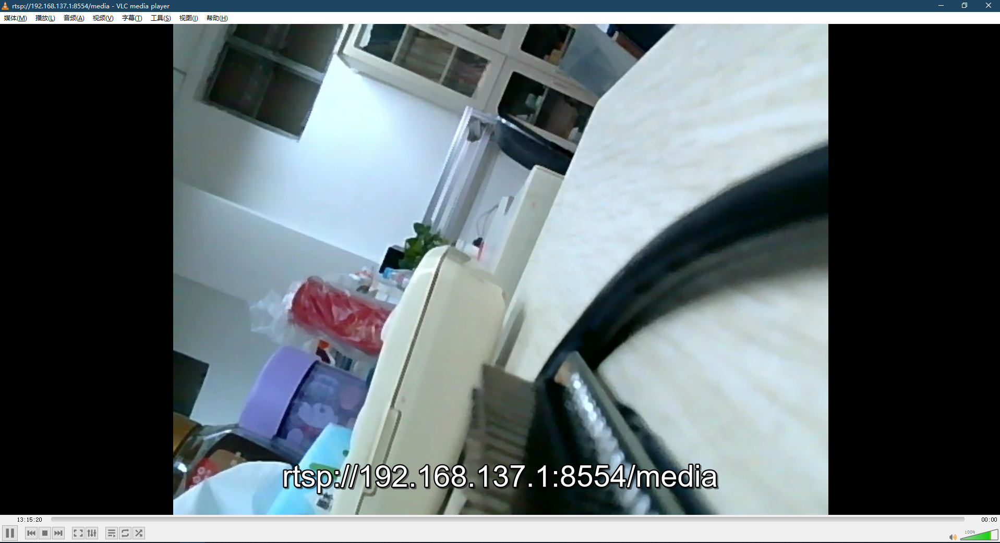

# Qt_YOLOv5_RK3566

- [Qt\_YOLOv5\_RK3566](#qt_yolov5_rk3566)
  - [Overview 简介](#overview-简介)
  - [Tree 文件描述](#tree-文件描述)
  - [Device Connection 设备连接](#device-connection-设备连接)
    - [1. Install adbkit 安装adbkit](#1-install-adbkit-安装adbkit)
    - [2. USB to TCP](#2-usb-to-tcp)
  - [Dependency 依赖库安装](#dependency-依赖库安装)
    - [1. RKNN-Toolkit2](#1-rknn-toolkit2)
    - [2. Qt5](#2-qt5)
    - [3. OpenCV](#3-opencv)
    - [4. FFmpeg](#4-ffmpeg)
      - [DRM](#drm)
      - [RGA](#rga)
      - [MPP](#mpp)
      - [X264](#x264)
      - [FFmpeg](#ffmpeg)
  - [Getting Started 如何使用](#getting-started-如何使用)
    - [Evn 设置环境](#evn-设置环境)
    - [Compile client 编译客户端](#compile-client-编译客户端)
    - [Run client 运行客户端](#run-client-运行客户端)
    - [Run server 运行服务端 （if needed）](#run-server-运行服务端-if-needed)
  - [Screenshots 效果展示](#screenshots-效果展示)

## Overview 简介

A Qt project application based on YOLOv5 in the [rknn_model_zoo](https://github.com/airockchip/rknn_model_zoo) example, using Opencv to read the camera and display it on the Qt interface, while streaming to the client via UDP

基于[rknn_model_zoo](https://github.com/airockchip/rknn_model_zoo)示例中YOLOv5的一个Qt项目应用，采用Opencv读取摄像头，并显示到Qt界面上，同时通过UDP推流到客户端

更新：目前可以通过mpp编码为rtsp流，并利用ffmpeg推流，客户端可以直接用vlc拉流，就可以不用Qt的客户端了。

The detection model has not been improved yet, and the original model in the open source project is still used

检测模型尚未进行改良，使用的还是开源项目中的原模型

* Platform: RK3566（泰山派开发板2G+16G版本）
* Qt version: 5.12.10
* Opencv version: 3.4.1
* environment: WSL2

## Tree 文件描述
```
.
├── 3rdparty                    # 第三方库
├── CMakeLists.txt
├── README.md
├── Windows                     # 客户端Demo
│   ├── main.cpp
│   ├── mainwindow.cpp
│   ├── mainwindow.h
│   ├── mainwindow.ui
│   ├── qtyolo_rc.pro
│   └── qtyolo_rc.pro.user
├── YOLOv5                      # 检测模型
│   ├── cpp
│   └── model
├── build-linux.sh              # 编译装载脚本
├── main.cpp                    # 主函数
├── mainwindow.cpp
├── mainwindow.h
├── mainwindow.ui
└── utils                       # 工具
    ├── CMakeLists.txt
    ├── audio_utils.c
    ├── audio_utils.h
    ├── common.h
    ├── file_utils.c
    ├── file_utils.h
    ├── font.h
    ├── image_drawing.c
    ├── image_drawing.h
    ├── image_utils.c
    └── image_utils.h
```
## Device Connection 设备连接
Since WSL2 cannot recognize USB devices, I have been copying files in WSL2 to Windows and then using adb to transfer them to Taishan Pi, that is, WSL2<--->Windows<--->board. Later, I found that adbkit can simulate USB devices into TCP ports, and then connect to WSL2 through the network, so that it can be done in one step: board<--->WSL2

由于WSL2无法识别USB设备，之前一直是将WSL2中的文件copy到Windows再利用adb传到泰山派上，即WSL2<--->Windows<--->板子，后来发现adbkit可以将USB设备模拟成tcp端口，然后再通过网络连接到WSL2，这样就可以一步到位：板子<--->WSL2
### 1. Install adbkit 安装adbkit
First install [node](https://nodejs.org/zh-cn/download) on Windows

首先在Windows上安装[node](https://nodejs.org/zh-cn/download)

```shell
# Download and install fnm:
winget install Schniz.fnm
# Download and install Node.js:
fnm install 22
# Verify the Node.js version:
node -v # Should print "v22.14.0".
# Verify npm version:
npm -v # Should print "10.9.2".
```
After the installation is complete, remember to add node to the **PATH**

安装完成后记得把node添加到**环境变量**

Then install adbkit via npm

然后通过npm安装adbkit
```shell
npm install --save adbkit
```

### 2. USB to TCP
First query the Windows IP, which corresponds to the Ethernet of WSL

首先查询Windows的IP，需要对应WSL的那个以太网
```shell
ipconfig
```


You also need to check the ID number of your device

还要查询自己设备的ID号
```shell
adb devices
```

Then simulate the USB as a TCP port on Windows,  your_adb_device_ID here is the device ID queried in the previous step.

然后在Windows上将USB模拟为TCP端口，这里的your_adb_device_ID就是上一步所查询的设备ID
```shell
node your_path_to_adbkit usb-device-to-tcp your_adb_device_ID -p your_port
# eg. node node_modules/adbkit/bin/adbkit usb-device-to-tcp 913f75e3ec33c186 -p 8080
```

Finally, use adb to connect to the port of the corresponding IP on WSL, so that adb can connect to our board :)

最后利用adb在WSL上连接到对应IP的端口，这样adb就可以连接到我们的开发板了:)
```shell
# connect to Windows
adb connect your_IP:your_port
# eg. adb connect 192.168.1.1:8080
# connect to board
adb shell
```

## Dependency 依赖库安装

### 1. RKNN-Toolkit2

The model in rknn_model_zoo requires RKNN-Toolkit2 for model conversion, so you need to prepare [RKNN-Toolkit2](https://github.com/airockchip/rknn-toolkit2) before use.
For the specific process, please refer to the Quick Start document in [link](https://github.com/airockchip/rknn-toolkit2/tree/master/master/doc). This document is very detailed and will also take you to run yolo in rknn_model_zoo.

rknn_model_zoo里面的模型需要RKNN-Toolkit2进行模型转换，所以在使用前需要准备好[RKNN-Toolkit2](https://github.com/airockchip/rknn-toolkit2)
具体过程可以参照[链接](https://github.com/airockchip/rknn-toolkit2/tree/master/master/doc)里的Quick Start文档，这个文档很详细，还会带着你跑一次rknn_model_zoo里面的yolo，所以就不再赘述

### 2. Qt5

The transplantation of Qt5 is available in the official documentation of Taishan School. Here is the [link](https://wiki.lckfb.com/zh-han/tspi-rk3566/documentation/transplant-qt5.html). Just follow it.

It should be noted that our client will directly use CMake to compile Qt files later, so qmake will not be used for client.

Qt5的移植在泰山派的官方文档中有，这里给出[链接](https://wiki.lckfb.com/zh-hans/tspi-rk3566/documentation/transplant-qt5.html)，照着移植就好

需要注意的是我们的客户端后面会直接采用CMake的方式编译Qt文件，所以不会用qmake

### 3. OpenCV

There are many methods for porting OpenCV on the Internet. You can refer to [Porting OpenCV to I.MX6U](https://blog.csdn.net/hanhui22/article/details/111476459) by Atom Brother for porting. We have already installed the cross compiler part, so you can skip this part.

OpenCV的移植方法网上有很多，可以参照原子哥的[I.MX6U移植OpenCV](https://blog.csdn.net/hanhui22/article/details/111476459)进行移植。其中交叉编译器部分前面我们已经安装好了，这个部分可以直接跳过

### 4. FFmpeg

[ffmpeg](https://github.com/nyanmisaka/ffmpeg-rockchip)需要采用适用于rockchip的魔改版，而移植ffmpeg需要提前移植DRM，RGA和MPP

#### DRM

下载[DRM](https://dri.freedesktop.org/libdrm/)，我是用的是2.4.107
```shell
wget https://dri.freedesktop.org/libdrm/libdrm-2.4.107.tar.xz
tar -xf libdrm-2.4.107.tar.xz
```

由于libdrm项目是基于meson构建的，所以需要安装meson
```shell
sudo apt install meson
```
配置工具链
```shell
vim cross-file.txt
###########################################################
  1 [binaries]
  2 c = 'aarch64-linux-gnu-gcc'
  3 cpp = 'aarch64-linux-gnu-g++'
  4 ar = 'aarch64-linux-gnu-ar'
  5 strip = 'aarch64-linux-gnu-strip'
  6
  7 [host_machine]
  8 system = 'linux'
  9 cpu_family = 'aarch64'
 10 cpu = 'aarch64'
 11 endian = 'little
```


配置编译
```shell
mkdir install
mkdir cross-build
cd cross-build
meson --prefix=$(pwd)/../install --cross-file=../cross_file.txt -D exynos=enabled
ninja && ninja install
```

#### RGA
这里没有采用[wiki](https://github.com/nyanmisaka/ffmpeg-rockchip/wiki/Compilation)里的meson，因为我发现包里面有cmake，遂采用
```shell
# 下载包
git clone -b jellyfin-rga --depth=1 https://github.com/nyanmisaka/rk-mirrors.git rkrga
```

配置环境
```shell
cd rkrga/toolchains
vim toolchain_linux.cmake
###########################################################
  1 SET(TOOLCHAIN_HOME "your_path_to_toolchain")
  2 SET(TOOLCHAIN_NAME "your_name_of_toolchain")
  3
  4 # this is required
  5 #SET(CMAKE_SYSTEM_NAME Linux)
  6
  7 # specify the cross compiler
  8 SET(CMAKE_C_COMPILER ${TOOLCHAIN_HOME}/bin/${TOOLCHAIN_    NAME}-gcc)
  9 SET(CMAKE_CXX_COMPILER ${TOOLCHAIN_HOME}/bin/${TOOLCHAI    N_NAME}-g++)
 10
 11 # where is the target environment
 12 SET(CMAKE_FIND_ROOT_PATH  ${TOOLCHAIN_HOME})
 13
 14 # search for programs in the build host directories (no    t necessary)
 15 SET(CMAKE_FIND_ROOT_PATH_MODE_PROGRAM NEVER)
 16 # for libraries and headers in the target directories
 17 SET(CMAKE_FIND_ROOT_PATH_MODE_LIBRARY ONLY)
 18 SET(CMAKE_FIND_ROOT_PATH_MODE_INCLUDE ONLY)
```
开始编译
```shell
./cmake-linux.sh
```

#### MPP

```shell
git clone -b jellyfin-mpp --depth=1 https://github.com/nyanmisaka/mpp.git rkmpp
mkdir rkmpp_build
pushd rkmpp_build
cmake \
    -DCMAKE_INSTALL_PREFIX=rkmpp_build \
    -DCMAKE_BUILD_TYPE=Release \
    -DBUILD_SHARED_LIBS=ON \
    -DBUILD_TEST=OFF \
    ..
make -j $(nproc)
make install
```

#### X264
参照[泰山派官方文档](https://wiki.lckfb.com/zh-hans/tspi-rk3566/documentation/buildroot-add-ffmpeg.html#_1%E3%80%81%E4%B8%8B%E8%BD%BDx264%E6%BA%90%E7%A0%81)的移植方法

```shell
# 下载
git clone https://code.videolan.org/videolan/x264.git
cd x264
```

配置交叉编译环境
```shell
mkdir x264build
vim autoConfig.sh
#########################################
  1 #!/bin/bash
  2
  3 # 定义变量
  4 # 设置x264的安装位置
  5 PREFIX="./x264build"
  6
  7 # 交叉编译器bin路径,使用aarch64-linux-gnu-gcc -v命令查看
  8 TOOLCHAIN_DIR="/usr/bin"
  9
 10 # 工具链前缀，用于指定交叉编译工具的路径
 11 TOOLCHAIN="$TOOLCHAIN_DIR/aarch64-linux-gnu-"
 12
 13 # 运行 configure 脚本
 14 echo "正在配置 x264..."
 15 ./configure \
 16   --prefix=$PREFIX \
 17   --disable-asm \
 18   --enable-shared \
 19   --enable-static \
 20   --host=aarch64-linux-gnu \
 21   --cross-prefix=$TOOLCHAIN \
 22   --enable-pic
 23
 24 # 检查 configure 的返回状态
 25 if [ $? -ne 0 ]; then
 26   echo "错误：配置 x264 失败。"
 27   exit 1
 28 else
  29   echo "配置成功。"
 30 fi
 31
 32 # 编译 x264
 33 echo "正在编译 x264..."
 34 # 使用 nproc 获取处理器核心数，以确定并行编译的进程数
 35 make -j$(nproc)
 36
 37 # 检查编译的返回状态
 38 if [ $? -ne 0 ]; then
 39   echo "错误：编译 x264 失败。"
 40   exit 1
 41 else
 42   echo "编译成功。"
 43 fi
 44
 45 # 安装 x264
 46 echo "正在安装 x264..."
 47 make install
 48
 49 # 检查安装的返回状态
 50 if [ $? -ne 0 ]; then
 51   echo "错误：安装 x264 失败。"
 52   exit 1
 53 else
 54   echo "安装成功。"
 55 fi
 56
 57 # 清理构建目录
 58 echo "正在清理..."
 59 make clean
 60
 61 # 检查清理的返回状态
 62 if [ $? -ne 0 ]; then
 63   echo "警告：清理构建目录失败。"
 64 else
 65   echo "构建过程完成。"
 66 fi
 67
 68 # 脚本正常退出
 69 exit 0
```

给权限执行
```shell
chmod +x autoConfig.sh
./autoConfig.sh
```

#### FFmpeg
下载FFmpeg，同样参照[泰山派官方文档](https://wiki.lckfb.com/zh-hans/tspi-rk3566/documentation/buildroot-add-ffmpeg.html#_1%E3%80%81%E4%B8%8B%E8%BD%BDx264%E6%BA%90%E7%A0%81)
```shell
git clone --depth=1 https://github.com/nyanmisaka/ffmpeg-rockchip.git ffmpeg
cd ffmpeg
```
配置编译环境
```shell
vim autoConfig.sh
###################################
  1 #!/bin/bash
  2 # 定义前缀目录
  3 PREFIX="./ffmpeg_rk_build"
  4
  5 # x264安装目录的绝对路径
  6 X264_BUILD_DIR="your_path_to_x264_install"
  7 DRM_BUILD_DIR="your_path_to_drm_install"
  8 MPP_BUILD_DIR="your_path_to_rkmpp_install"
  9 RGA_BUILD_DIR="your_path_to_rga_install"
 10
 11 # x264安装目录中include目录绝对路径
 12 X264_INCLUDE_DIR="$X264_BUILD_DIR/include"
 13 DRM_INCLUDE_DIR="$DRM_BUILD_DIR/include"
 14 MPP_INCLUDE_DIR="$MPP_BUILD_DIR/include"
 15 RGA_INCLUDE_DIR="$RGA_BUILD_DIR/include"
 16 INCLUDE_DIR="-I$X264_INCLUDE_DIR -I$MPP_INCLUDE_DIR -I$RGA_INCLUDE_DIR -I$DRM    _INCLUDE_DIR"
 17
 18
 19 # x264安装目录中lib目录绝对路径
 20 X264_LIB_DIR="$X264_BUILD_DIR/lib"
 21 DRM_LIB_DIR="$DRM_BUILD_DIR/lib"
 22 MPP_LIB_DIR="$MPP_BUILD_DIR/lib"
 23 RGA_LIB_DIR="$RGA_BUILD_DIR/lib"
 24 LIB_DIR="-L$X264_LIB_DIR -L$DRM_LIB_DIR -L$MPP_LIB_DIR -L$RGA_LIB_DIR"
 25 # 设置 PKG_CONFIG_PATH 环境变量
 26 PKG_PATH="$X264_LIB_DIR/pkgconfig:$MPP_LIB_DIR/pkgconfig:$RGA_LIB_DIR/pkgconfig:$DRM_LIB_DIR/pkgconfig:"
 27 export PKG_CONFIG_PATH=$PKG_PATH
 28
 29 echo "配置环境变量："
 30 echo "export PKG_CONFIG_PATH=$PKG_CONFIG_PATH"
 31
 32 echo "正在配置./configure..."
 33
 34 ./configure \
 35         --prefix=$PREFIX \
 36         --enable-shared \
 37         --disable-static \
 38         --enable-cross-compile \
 39         --arch=aarch64 \
 40         --disable-stripping \
 41         --target-os=linux \
 42         --cc=aarch64-linux-gnu-gcc \
 43         --enable-libx264 \
 44         --extra-cflags="$INCLUDE_DIR" \
 45         --extra-ldflags="$LIB_DIR" \
 46         --pkg-config-flags="--static" \
 47         --extra-libs="-lpthread -lm" \
 48         --enable-gpl \
 49         --enable-pic \
 50         --enable-nonfree \
 51         --enable-pthreads \
 52         --enable-version3 \
 53         --enable-rkmpp \
 54         --enable-rkrga \
 55         --enable-libdrm
```

给权限执行
```shell
chmod +x autoConfig.sh
./autoConfig.sh
```

编译完成后要把编译的库文件全部copy到板子的/usr/lib目录下，可执行文件要copy到/usr/bin目录下


## Getting Started 如何使用

### Evn 设置环境

1. Change **GCC_COMPILER** in the file **build-linux.sh** to the path of your own cross compiler
   
   将文件**build-linux.sh**中**GCC_COMPILER**改为自己交叉编译器的路径
2. Change the paths of Qt5 and Opencv in the top-level **CMakeLists.txt** to your own paths
   
   将顶层**CMakeLists.txt**中Qt5和Opencv的路径改为自己的路径
3. Modify the target IP and target port in the client file **mainwindow.cpp**
   
   修改客户端文件**mainwindow.cpp**中的目标ip和目标端口
4.  Modify the listening port in the server file **mainwindow.cpp**, which needs to correspond to the target port in the previous step
    
    修改服务端文件**mainwindow.cpp**中的监听端口，需要和上一步的目标端口对应

5. 修改**command_mpp**文件中的目标服务器ip和目标端口

6.  Connect the board and the server host to the same LAN
   
    将板子和服务端主机连接到同一局域网下

### Compile client 编译客户端
Just run:

运行
```bash
mkdir build
./build-linux.sh
```

### Run client 运行客户端

Transfer the generated install directory to the development board, configure the link path and run

将生成的install目录传输到开发板上，配置链接路径并运行

```bash
adb push install your_board_path
adb shell
cd your_board_path/install
export LD_LIBRARY_PATH=./lib
./qtyolov5 model/your_model
```

### Run server 运行服务端 （if needed）

Open the **Windows folder** and compile and run it using Qt Creater

将**Windows文件夹**使用Qt Creater打开编译运行

## Screenshots 效果展示

实测在干扰较小的情况下，开启检测的延迟在1-2秒之间，不开检测延迟在400毫秒左右

<center class="half">
    
</center>
<center class="half">
    
</center>
<center class="half">
    
</center>
<center class="half">
    
</center>
